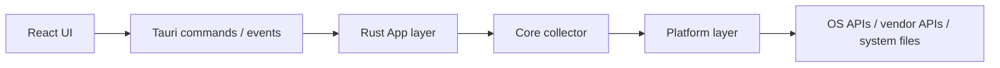
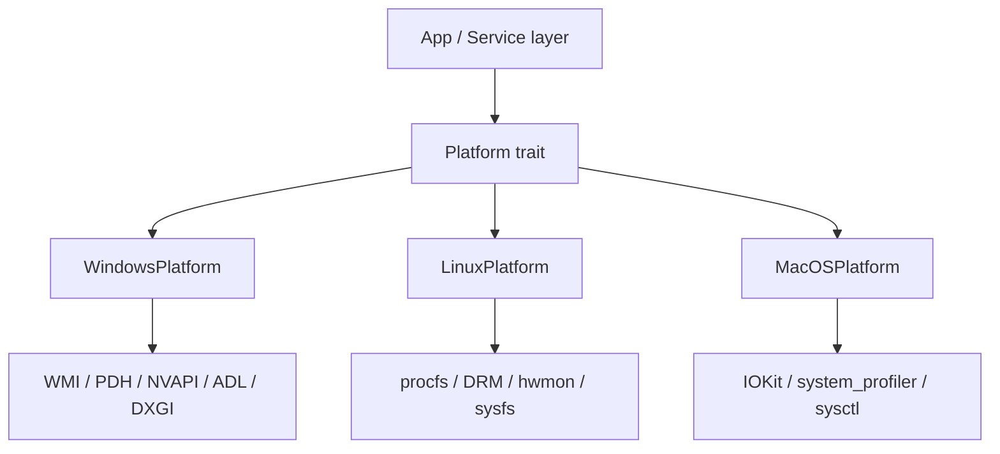
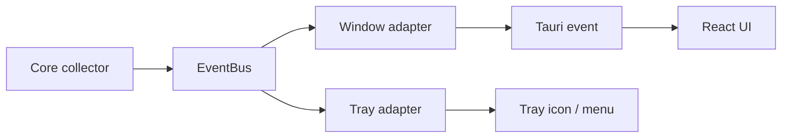

## はじめに

この記事では、私が開発している [HardwareVisualizer](https://github.com/shm11C3/HardwareVisualizer) について書きます。ただし、単なる機能紹介ではなく、作っている中で見えてきた技術的な面白さに寄せた話です。

最初から汎用的なハードウェア監視ツールを作ろうとしていたわけではありません。PC ケースの中に組み込む小さなモニター向けに構想を練っているうちに、今のようなハードウェアモニターへ変化していきました。実際に手を動かしてみると、Web UI、Tauri、Rust、OS API、CI/CD、ライセンス管理、コード署名、配布サイトまで含む、かなり総合的なプロジェクトになりました。

## HardwareVisualizer とは

<!-- markdownlint-disable MD034 -->

https://github.com/shm11C3/HardwareVisualizer

<!-- markdownlint-enable MD034 -->

HardwareVisualizer は、CPU、GPU、メモリなどの状態をリアルタイムに可視化する、無料・軽量・オープンソースのハードウェア監視ツールです。

Windows / macOS / Linux に対応しており、現在は [公式サイト](https://hardviz.com/ja/) と [GitHub Releases](https://github.com/shm11C3/HardwareVisualizer/releases) から配布しています。Windows では winget からもインストールできます。


主な機能は次のようなものです。

- CPU / GPU / RAM / Storage / Process / Network / Motherboard などの情報表示
- CPU / Memory / GPU の使用率グラフ
- 過去データを使ったインサイト表示
- プロセスごとの使用率や実行時間の表示
- ダッシュボード、テーマ、背景画像のカスタマイズ
- 日本語 / 英語対応

2024年6月に開発を始め、2024年10月に初回リリースを出しました。この記事を書いている 2026年6月時点では、v1.8 系までリリースしています。

## 作ったきっかけ

きっかけは自作PCでした。

PC ケースの中に小さなモニターを組み込んで、そこに CPU や GPU の状態を表示したい。最初はその用途に向けて構想を練っていました。温度、使用率、メモリ使用量、GPU の状態がケース内のディスプレイに出ていると、実用性もあるし単純に楽しい。自作PCをやっていると、そういう「必要だから」だけでは説明しきれない、少しロマン寄りの欲求が出てきます。


もちろん、既存のハードウェア監視ツールはたくさんあります。OS 標準のタスクマネージャーやアクティビティモニタもありますし、HWiNFO のような強力なツールもあります。

一方で、自分が欲しかったものとは少し違いました。

OS 標準ツールは、確認したい情報にたどり着くまでに画面を切り替える必要があったり、数字の羅列に見えたりします。高機能なサードパーティ製ツールはとても便利ですが、UI が古めだったり、ゲーミング寄りの見た目だったり、特定の OS やハードウェアに強く依存していたりします。

ケース内モニターに表示する情報や見せ方を考えるうちに、欲しいものは少しずつ広がっていきました。専用の小さな表示画面ではなく、日常的に開いておけるハードウェアモニターとして使いたくなったのです。

- CPU、GPU、メモリなどの状態を一画面で見たい
- グラフや履歴で傾向を追いたい
- 見た目も自分の環境に合わせたい
- Windows だけでなく、Linux や macOS でも動かしたい
- Web フロントエンドの開発体験を活かしつつ、ネイティブ寄りの実装にも踏み込みたい

このあたりを考えるうちに、最初の「ケース内モニター用の表示」から、今の HardwareVisualizer の方向へ変化していきました。

もうひとつ大きかったのは、技術テーマとして面白そうだったことです。

ハードウェア監視ツールは、単に画面を作るだけでは成立しません。CPU 使用率、GPU 使用率、メモリ、ストレージ、プロセス、ネットワーク、温度。これらの情報は、OS やデバイス、ドライバ、権限によって取得方法が変わります。同じ「GPU 使用率」でも、Windows、Linux、macOS で話が違うし、NVIDIA、AMD、Intel でもまた話が変わります。

Web アプリのようにブラウザという共通実行環境があるわけではなく、ユーザーのローカルマシンそのものが実行環境です。そこに Tauri と Rust で踏み込めるのは、個人開発のテーマとしてかなり魅力的でした。

あと、単純に Rust を使ってみたかったというのもあります。モテるターミナル[^wezterm] も Rust 製なので、Rust を書けば自分も少しはモテるかもしれません。たぶん。

調べれば調べるほど「これはちゃんと作ると面白いぞ」と思うようになりました。そこから少しずつ、ハードウェア情報を見やすく表示するだけでなく、クロスプラットフォーム対応、履歴データ、インサイト、配布、OSS 運用まで広げていったのが今の HardwareVisualizer です。

## 作ってみたら、ただの画面作りではなかった

最初は「ハードウェア情報を取得して、いい感じに表示するアプリ」くらいに考えていました。

しかし、実際には大きく分けて次の領域を全部見る必要があります。

| 領域 | 使っているもの |
| --- | --- |
| UI | React / TypeScript / Jotai / Tailwind CSS / shadcn/ui / Recharts |
| デスクトップアプリ基盤 | Tauri |
| バックエンド | Rust |
| データ保存 | SQLite |
| Web サイト | Astro |
| CI/CD | GitHub Actions |

UI は Web 技術で作っています。React で画面を作り、Recharts でグラフを描き、Tauri の IPC を通じて Rust 側からハードウェア情報を受け取ります。

一方で、ハードウェア情報の取得や OS 差異の吸収は Rust 側の仕事です。フロントエンドだけでは触れない領域が多く、Tauri を使うことで Web UI とネイティブ寄りの実装をつなげています。

ざっくり書くと、流れはこうです。



この構成にしたことで、UI は Web の開発体験を使いつつ、重い処理や OS 依存の処理は Rust 側に寄せられます。

## ハードウェア情報取得の難しさ

この開発で一番面白く、同時に大変なのは、ハードウェア情報の取得です。

たとえば CPU 使用率やメモリ使用量のような基本的な情報は、ある程度共通ライブラリで扱えます。しかし GPU、温度、ストレージ健康状態、マザーボード情報のようなものになると、急に世界がばらけます。

現在の HardwareVisualizer では、ざっくり次のような情報源を使っています。

| 対象 | 主な取得元 |
| --- | --- |
| 共通の CPU / メモリ / ストレージ情報 | sysinfo |
| Windows のメモリ / システム情報 | WMI |
| Windows の GPU エンジン使用率 | PDH |
| Windows の CPU 温度 | PawnIO（対応環境のみ）/ ACPI Thermal Zone |
| NVIDIA GPU | NVAPI |
| AMD GPU | ADL / DXGI |
| Intel GPU | DXGI |
| Linux のシステム情報 | procfs |
| Linux の GPU / センサー情報 | DRM / hwmon / sysfs |
| macOS のシステム情報 | IOKit / system_profiler / sysctl |
| ストレージ健康状態 | SMART / smartctl など |

表にするとすっきり見えますが、実装ではなかなか大変です。

- OS ごとに API が違う
- GPU ベンダーごとに SDK や取得方法が違う
- 同じ名前のメトリクスでも意味や精度が揃わない
- 権限がないと取れない情報がある
- 取得できない環境では、失敗ではなく「未対応」として扱う必要がある
- 常駐アプリなので、取得処理自体が重いと本末転倒になる

特にハードウェア監視ツールでは、「全部取れなければエラー」では使いづらくなります。ユーザーの環境はそれぞれ違うので、取れるものは表示し、取れないものは安全に空として扱う。そういうベストエフォートな設計が必要になります。

## OS 差異を設計で吸収する

初期の実装では、サービス層の中に OS ごとの条件分岐が増えていきました。

Windows なら WMI、Linux なら procfs、GPU は NVIDIA なら NVAPI、AMD なら ADL、macOS なら IOKit。最初は小さな分岐でも、対象が増えるにつれて見通しが悪くなります。

そこで導入したのが Platform Abstraction Layer です。



Rust のコードでは、OS ごとの実装を直接呼ぶのではなく、共通の trait と factory を通す形にしています。この `Platform` trait は、メモリ、GPU、ネットワーク、マザーボード、権限昇格といった OS 依存の操作をまとめる境界になっています。

<!-- markdownlint-disable MD034 -->

https://github.com/shm11C3/HardwareVisualizer/blob/e5036d01b09e47043f10e4e861e0170047cbf384/core/src/platform/traits.rs#L9-L105

実際にどの OS の実装を使うかは `PlatformFactory` で選びます。ここで `#[cfg(target_os = "...")]` によって Windows / Linux / macOS の実装を切り替えています。

https://github.com/shm11C3/HardwareVisualizer/blob/e5036d01b09e47043f10e4e861e0170047cbf384/core/src/platform/factory.rs#L29-L50

上位層は「GPU 情報を取得したい」「メモリ詳細を取得したい」とだけ考え、実際にどの API を使うかは各 OS の実装に閉じ込めます。

この形にすると、新しいメトリクスを追加するときに考えることが整理されます。

1. これはどのプラットフォーム共通の概念か
2. OS ごとにどう取得するか
3. 取れない場合は `None` や空配列で表せるか
4. UI では未対応・未取得をどう見せるか

「OS ごとの差異をなくす」のではなく、「差異があることを前提に、境界を決める」ことが大事でした。

## Core と App を分けた

開発が進むにつれて、もうひとつ大きな設計変更をしました。

Rust 側を Tauri アプリそのものから切り離し、Tauri に依存しない `hardviz-core` と、Tauri 境界を持つ `src-tauri` 側に分けました。

これは、単に「きれいに分けたかった」からではありません。機能が増えるにつれて、自然と分けるべき力学が強くなっていきました。

たとえば、ハードウェア情報は画面に表示するだけではなく、バックグラウンドで蓄積してインサイトに使いたい。メインウィンドウとは別に、トレイにも簡易的な情報を出したい。さらに将来的には、ゲーム中に使いやすいオーバーレイ的な UI も考えたい。こうなると、ハードウェア情報の収集ロジックが特定の window や React 画面に強く結びついていると、すぐに苦しくなります。

そこで、ハードウェア情報を集める Core と、それを Tauri アプリとして表示・操作する App を分けることにしました。

現在の責務は大まかに次のようになっています。

| 層 | 役割 |
| --- | --- |
| `hardviz-core` | ハードウェア情報の収集、履歴保持、EventBus、Platform Layer、永続化の一部 |
| `src-tauri` | Tauri command、window event、設定画面、アプリ起動、プラグイン、UI 向け DTO 変換 |
| Frontend | React UI、グラフ、設定画面、ユーザー操作 |

リアルタイムの監視データは、Core 側で周期的にサンプリングし、EventBus に流します。メインウィンドウ向けの adapter はそれを Tauri event としてフロントエンドに渡し、トレイ向けの adapter は React UI を介さずトレイ表示の更新に使います。



この分離にはいくつか利点があります。

- Core を Tauri なしでテストしやすい
- 収集ロジックが UI や window に依存しない
- バックグラウンドでの蓄積と画面表示を分けて考えられる
- トレイ、通知、ゲーム用 UI など、出力先を増やしやすい
- 「ハードウェア情報の事実」と「UI 表示の都合」を分けられる

たとえば温度は Core では摂氏の生値として扱い、華氏への変換は App 側で行います。こういう細かい責務分離が、後から効いてきます。

## 常駐アプリとしてのパフォーマンス

ハードウェア監視ツールなのに、監視ツール自身が CPU やメモリを食いすぎると本末転倒です。

そのため、パフォーマンスはかなり気にしています。

- 取得頻度を上げすぎない
- 重い外部コマンドを常時叩かない
- 画面が非表示・最小化されているときの更新を抑える
- SQLite への保存頻度を制御する
- グラフ描画で不要な再レンダリングを増やさない

また、GitHub Actions 上でパフォーマンステストも動かしています。アプリを起動し、一定時間の CPU 使用率やメモリ使用量を監視して、しきい値を超えたら検知できるようにしています。

個人開発だと「動けばOK」に寄りがちですが、常駐系アプリでは継続的に軽さを見る仕組みがかなり重要でした。

## OSS として配るところまでが個人開発だった

HardwareVisualizer は MIT License の OSS として公開しています。

ソースを公開するだけなら簡単ですが、デスクトップアプリとして配布し、継続して使ってもらうには別の課題が出てきます。

### MIT License にしたことで難しくなったこと

ライセンスについては、今振り返ると MIT にしたことで難しくなった面もあります。ハードウェア情報取得まわりの OSS には GPL 系ライセンスのものも多く、便利なライブラリであっても、同梱やリンクの仕方によっては配布物全体のライセンス設計に影響します。

もちろん GPL が悪いという話ではありません。とはいえ、HardwareVisualizer は MIT License のまま、誰でも扱いやすい形で配布したいという方針があります。そのため、ハードウェアアクセスの実装では、既存実装を取り込むのではなく、OS やベンダーが公開している仕様、ドキュメント、API を確認しながら、必要な範囲をなるべく自前で実装する方針を取っています。

この判断は開発コストと難易度を上げます。特にハードウェア系は、OS API、ベンダー SDK、カーネルやシステムファイル、外部コマンドなどを個別に調べる必要があります。それでも、配布しやすさとライセンスの見通しを優先するなら、避けて通れない部分でした。

ただ、この面倒さは同時に面白さでもあります。単にライブラリを組み合わせるだけではなく、OS やデバイスがどう情報を公開しているのかを調べ、必要な範囲を自分で実装していく。ここにはハードウェア監視ツールならではの手触りがあります。

### デスクトップアプリを安心して配るために

| 項目 | やっていること |
| --- | --- |
| CI | Rust / TypeScript / frontend / Tauri / E2E のチェック |
| リリース | GitHub Actions で各 OS 向け成果物を作成 |
| 配布 | GitHub Releases、公式サイト、winget |
| ライセンス | npm / Cargo 依存のライセンス確認と THIRD_PARTY_NOTICES 生成 |
| セキュリティ | CodeQL、OSV scan、Scorecard |
| 検証 | SHA-256 チェックサム、GitHub Artifact Attestations |
| コード署名 | macOS は署名・公証、Windows は署名対応を進行中 |

Web アプリなら、サーバー側にデプロイすれば利用者は同じものを使います。

しかしデスクトップアプリでは、ユーザーがローカルにインストーラーをダウンロードして実行します。つまり、次のようなこともプロダクト体験の一部になります。

- 公式配布元が分かること
- ダウンロードしたファイルが本物だと確認できること
- OS に警告されにくいこと
- 依存ライブラリのライセンスを同梱すること
- 古いバージョンからアップデートしやすいこと

「アプリを作る」だけではなく、「安心して配る」ことも必要でした。

このあたりは、個人開発でやるには正直かなり重いです。それでも、だからこそ実務にも近い学びがあります。CI/CD、リリース、セキュリティ、ライセンス、コード署名まで、自分で意思決定して運用することになります。

## 公式サイトも作った

個人 OSS は、作っただけではなかなか見つけてもらえません。

HardwareVisualizer では [hardviz.com](https://hardviz.com/ja/) という公式サイトも作っています。Astro で構築しており、機能紹介、ダウンロード、FAQ、変更履歴、インストーラーの検証手順などをまとめています。

これは単なる宣伝ページではなく、配布と信頼性のための入口でもあります。

- どこからダウンロードすればよいか
- 対応 OS や制限は何か
- 変更履歴はどこで見られるか
- インストーラーをどう検証できるか
- Issue や GitHub へどうたどり着けるか

OSS でも、ユーザーが最初に見る場所は GitHub の README とは限りません。検索から来る人もいれば、配布ページだけを見る人もいます。

作るだけではなく、届けるところまで含めて考える必要がありました。

## 個人開発として得られた学び

HardwareVisualizer を作っていて面白いのは、Web だけでは見えにくい領域に触れられることです。

普段 Web アプリを作っていると、OS やデバイス差異を直接扱う機会はそこまで多くありません。しかしデスクトップアプリ、特にハードウェア監視ツールを作ると、かなり現実の環境差に向き合うことになります。

- OS ごとの API 差異
- ベンダーごとの SDK
- 権限や署名
- インストーラーと配布
- ローカル DB とマイグレーション
- 常駐アプリとしての軽さ
- 公式サイトやドキュメント
- OSS としての Issue / PR / Release 運用

これは、小さな個人開発でありながら、かなり広い範囲を含むプロジェクトです。

業務では担当範囲が分かれることも多いですが、個人開発では全部自分で見ます。設計も、実装も、テストも、配布も、問い合わせも、ロードマップも、自分で判断することになります。

大変ではありますが、そのぶん学びの密度は高いです。

## おわりに

HardwareVisualizer は、もともと「自作PCに内蔵した小型モニターに、いい感じのハードウェア情報を出したい」という構想から始まりました。

そこから、Tauri / Rust / React を使ったデスクトップアプリになり、OS ごとのハードウェア情報取得、Core/App 分離、CI/CD、ライセンス管理、コード署名、公式サイト運用まで含むプロジェクトになっています。

作る前は、ハードウェア監視ツールは「システム情報を取って画面に出すアプリ」くらいに考えていました。実際に作ってみると、そこには OS API、デバイス差異、権限、配布、署名、ライセンスといった、Web だけではあまり触れない領域が詰まっていました。

小さなミニモニター用ダッシュボードの構想からここまで広がったのは予想外でしたが、その予想外の広がりこそが、このプロジェクトで一番面白いところだったと思います。

この記事では全体像を中心に書きました。ハードウェア情報の取得方法や、デスクトップアプリの配布・コード署名まわりは、今後もう少し掘り下げて書いていきたいです。

気になった方は、公式サイトや GitHub から触ってみてもらえるとうれしいです。

公式サイトはこちらです。

<!-- markdownlint-disable MD034 -->

https://hardviz.com/ja/

<!-- markdownlint-enable MD034 -->

GitHub リポジトリはこちらです。

<!-- markdownlint-disable MD034 -->

https://github.com/shm11C3/HardwareVisualizer

<!-- markdownlint-enable MD034 -->

Windows なら winget でもインストールできます。

```powershell
winget install shm11C3.HardwareVisualizer
```

[^wezterm]: [モテるターミナルにカスタマイズしよう（WezTerm）](https://zenn.dev/mozumasu/articles/mozumasu-wezterm-customization)
