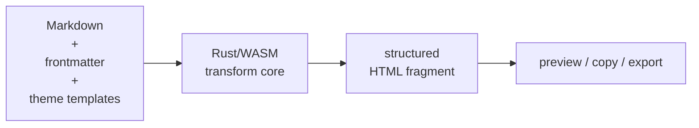
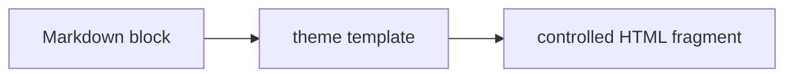
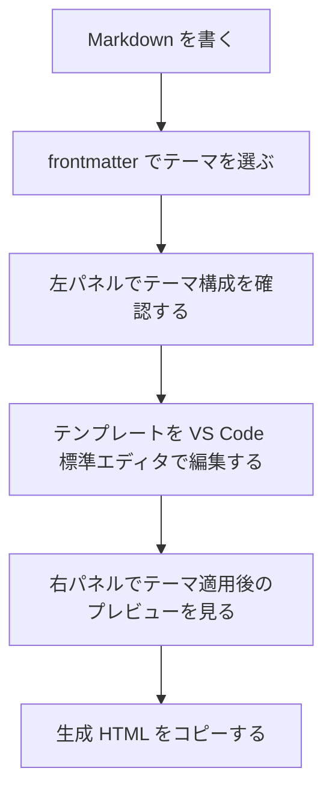
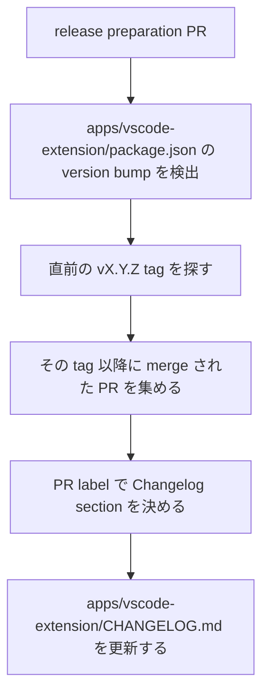

:::message
この記事は生成AIの補助で執筆しています。
:::

## はじめに

Markdown は書きやすいです。
エディタも選べるし、Git で管理しやすいし、AI に下書きを作らせるときの中間形式としても扱いやすい。

一方で、Markdown を最終的に CMS、社内 Wiki、ヘルプセンター、デザインシステムに投入しようとすると、最後に困ることがあります。

それは「最終的に出てくる HTML の構造をどこまで制御できるか」という点です。

たとえば、次のような Markdown があるとします。

```md
## Notice

This action cannot be undone.
```

単にプレビューできればよいなら、普通の Markdown プレビューで十分です。
しかし、実際の運用では次のような HTML が欲しいことがあります。

```html
<h2 id="notice" class="article-heading article-heading--level2">Notice</h2>
<p class="article-body">This action cannot be undone.</p>
```

`h2` にどんな class を付けるか。
`p` をどんなコンポーネントとして出すか。
コードブロックや引用を、プロダクト側の HTML ルールにどう合わせるか。

このあたりを Markdown 側に直接書き始めると、せっかくの Markdown の軽さが失われます。
かといって、静的サイトジェネレータや CMS 全体を作りたいわけでもありません。

そこで開発しているのが `md-hinagata` です。

この記事では、`md-hinagata` が「何を作っているツールか」だけでなく、AI エージェントを前提に「どう作っているか」も合わせて書きます。具体的には、要件・設計・タスク・ADR・PR レビューをつないだ開発ループです。

先にまとめると、`md-hinagata` は Markdown を独自のエディタで編集するツールではありません。
VS Code 標準の Markdown 編集体験はそのまま使い、Markdown block を theme template に通して、CMS や社内 Wiki に投入しやすい HTML fragment を生成するための拡張機能です。

## md-hinagata とは

`md-hinagata` は、Markdown をテーマテンプレートという「型」に通して、構造を制御した HTML fragment に変換する VS Code 拡張です。

ざっくり書くと、こういう流れです。



通常の Markdown プレビュー拡張ではありません。
主役は「見た目のプレビュー」ではなく、**最終的に生成される HTML 構造をテーマテンプレートで制御できること**です。

たとえば、同じ Markdown でも、テーマを変えることで CMS 向け、社内 Wiki 向け、ヘルプセンター向け、メールマガジン向けの HTML に変換できるようにしたいと考えています。


ロゴは、Markdown で使う記号を組み合わせて、漢字の「形」をイメージして作成しました。
Markdown の軽さを残しながら、出力の「形」を整えるという、この拡張機能の方向性にも合わせています。

- Repository: https://github.com/shm11C3/md-hinagata
- VS Code Marketplace: https://marketplace.visualstudio.com/items?itemName=Shm11C3.md-hinagata-vscode-extension

この記事の時点では、`0.2.0` を VS Code Marketplace の stable release として公開済みです。


## 作ろうと思った理由

きっかけは、会社の技術ブログを WordPress で書いていたことです。
記事は最終的に HTML として扱う必要がありました。
ただ、毎回 HTML を直接書くのは重く、Zenn のように Markdown で気持ちよく書きながら、最後は必要な HTML に変換できる体験が欲しくなりました。

最初は [shm11C3/md-xformer](https://github.com/shm11C3/md-xformer) という CLI として作りました。
Markdown を HTML に変換するだけなら CLI でも十分です。
しかし、実際に文章を書いていると、「このテーマを通すとどう見えるか」「生成される HTML はどう変わるか」をその場で確認したくなります。

そこで、リアルタイムにプレビューしながら書ける体験を優先して、VS Code 拡張として作り直すことにしました。
`x-former` という名前にも独自性の面で課題があったので、名前も含めて `md-hinagata` として整理し直しています。

この問題は、WordPress に限った話ではありません。
たとえば、次のような場面でも同じような需要があります。

- CMS に HTML fragment として投入したい
- デザインシステムに沿った class を付けたい
- 社内 Wiki の決まった構造に合わせたい
- AI が生成した Markdown を、承認済みの HTML 構造に整形したい
- リリースノートや製品告知を定型 HTML 化したい

こういう場面では、Markdown の書きやすさは残しつつ、HTML 出力はきちんと制御したくなります。

既存の Markdown ツールは、だいたい次のどれかに寄っています。

- Markdown をプレビューする
- 静的サイト全体を生成する
- CMS のコンテンツを管理する
- いろいろな形式に文書変換する

もちろんそれぞれ便利です。
ただ、今回欲しかったのはもっと狭いものでした。



Markdown の各ブロックを、テーマごとのテンプレートに通して、予測可能な HTML component として出力する。
この一点に絞ったツールを作ることにしました。

## 最初に決めたこと：VS Code の編集体験を壊さない

最初に決めたのは、独自 Markdown エディタを作らないことです。

Markdown 本文の編集は、VS Code 標準エディタに任せます。
理由は単純で、VS Code の編集体験がすでに強いからです。

- 補完
- 検索
- diff
- Git 連携
- formatter
- workspace 管理
- 拡張機能との連携

これらを自前で作り直す必要はありません。
`md-hinagata` がやるべきことは、Markdown を気持ちよく編集することではなく、Markdown からどんな HTML を生成するかを制御することです。

そのため、現在の中心的な体験は次のようにしています。



画面としては、左に Theme Manager、右に Themed Preview、下地として通常の VS Code Markdown editor があるイメージです。


テンプレートをクリックしたら、左パネル内で小さな独自エディタを開くのではなく、普通に VS Code のエディタで `.hbs` ファイルを開きます。
この判断により、テンプレート編集でも diff、検索、Git、formatter などをそのまま使えます。

## frontmatter でテーマを選ぶ

テーマ選択は Markdown ファイル自身に持たせることにしました。

```md
---
hinagata:
  theme: default
  output: fragment
---

# Title

Body text.
```

VS Code の設定だけでテーマを選ぶ方法もあります。
しかし、それだと「この Markdown はどのテーマで変換されるべきか」が文書の外に出てしまいます。

`md-hinagata` では、出力を再現可能にしたかったので、文書側に `hinagata.theme` を持たせる方針にしました。

現在は、frontmatter の中で次の key を扱っています。

| Key                | Default     | Description                           |
| ------------------ | ----------- | ------------------------------------- |
| `hinagata.theme`   | `default`   | 使用する theme ID                     |
| `hinagata.output`  | `fragment`  | 出力形式。最初は実質 `fragment` のみ  |
| `hinagata.cssMode` | `style-tag` | 生成 HTML に theme CSS をどう含めるか |

`Select Theme` コマンドを実行すると、現在開いている Markdown の frontmatter を更新します。
frontmatter がない場合は先頭に追加し、既存 frontmatter がある場合は他のメタデータを保持したまま `hinagata.theme` を追加または更新します。

また、VS Code 拡張側では Markdown 先頭の frontmatter 内で `hinagata` key の補完も出します。
`hinagata.output` や `hinagata.cssMode` の固定値だけでなく、`hinagata.theme` には `Select Theme` と同じ選択可能テーマを候補として出すようにしています。

## 生成 HTML と CSS output mode

開発を進める中で大きかったのが、Preview と Copy の出力を同じ経路に寄せたことです。

当初は Preview でだけ theme CSS を別に適用したくなります。
しかし、それをやると「Preview では正しく見えるのに、Copy した HTML は別物」というズレが起きます。

そこで現在は、Rust core が返す `TransformResponse.html` を Preview でも `Copy Generated HTML` でも使います。
theme CSS をどう表現するかは `hinagata.cssMode` で選びます。

| Mode        | Output                                                                |
| ----------- | --------------------------------------------------------------------- |
| `style-tag` | theme CSS を `<style>` tag として document root の前に含める。default |
| `inline`    | 対応範囲内の CSS を `style` 属性へ展開する                            |
| `separate`  | document HTML と CSS を分けて返す                                     |
| `none`      | theme CSS なしの document HTML を返す                                 |

特に `inline` は、CMS やメール系のワークフローを考えると欲しくなる出力です。
ただし CSS の完全な inlining は深い沼なので、今は対応できる範囲を明確にし、未対応の CSS は `unsupported-inline-css` warning として返すようにしています。

## テーマは CSS ではなく「テンプレートパッケージ」

このツールでいう theme は、単なる CSS ではありません。

テーマは、次のようなファイル群を持つパッケージです。

```txt
.md-hinagata/
  themes/
    company-blog/
      theme.json
      styles.css
      templates/
        h1.hbs
        h2.hbs
        h3.hbs
        p.hbs
        codeblock.hbs
        blockquote.hbs
        ul.hbs
        ol.hbs
        li.hbs
```

`theme.json` には、テーマのメタデータと Markdown 要素ごとの template mapping を書きます。

```json
{
  "$schema": "https://raw.githubusercontent.com/shm11C3/md-hinagata/main/schemas/theme.schema.json",
  "schemaVersion": "0.1",
  "id": "company-blog",
  "name": "Company Blog",
  "version": "1.0.0",
  "entryCss": "styles.css",
  "templates": {
    "h1": "templates/h1.hbs",
    "h2": "templates/h2.hbs",
    "h3": "templates/h3.hbs",
    "p": "templates/p.hbs",
    "codeblock": "templates/codeblock.hbs",
    "blockquote": "templates/blockquote.hbs",
    "ul": "templates/ul.hbs",
    "ol": "templates/ol.hbs",
    "li": "templates/li.hbs"
  }
}
```

現在のドラフト版 theme JSON Schema は、リポジトリの `schemas/theme.schema.json` で管理しています。

テンプレートには Handlebars を使います。
たとえば `h2.hbs` はこんな感じです。

```hbs
<h2 id="{{id}}" class="article-heading article-heading--level2">
  {{{inner_html}}}
</h2>
```

コードブロックなら、こうです。

```hbs
<pre class="code-block"><code class="language-{{lang}}">{{code}}</code></pre>
```

現在のテンプレート変数の基本ルールは次のようにしています。

```txt
{{text}}
  heading / 段落のプレーンテキスト（escape して挿入）

{{{inner_html}}}
  Markdown children から生成された HTML

{{code}}
  codeblock のソース（escape して {{code}} で挿入）

{{lang}}
  codeblock の言語名

{{id}}
  heading などの HTML id

{{level}}
  heading level

{{start}}
  ol の開始番号
```

重要なのは、すべてを `{{{ }}}` で出せるようにはしないことです。
HTML として挿入できる変数は限定し、安全側に倒したいと考えています。

## Rust/WASM の変換コアにした理由

`md-hinagata` は VS Code 拡張ですが、変換処理の中心は Rust で書くことにしました。

VS Code 拡張側の責務は、VS Code に依存する処理です。

```txt
VS Code extension:
  read files
  manage webviews
  update frontmatter
  resolve workspace paths
```

一方、Rust core の責務は、エディタに依存しない変換処理です。

```txt
Rust core:
  parse frontmatter
  parse Markdown body
  receive theme packages
  apply templates
  generate HTML fragment
  return diagnostics
```

この分離には理由があります。

最初は VS Code 拡張だけを出しますが、将来的には CLI や CI validation でも同じ変換ロジックを使いたいからです。

たとえば将来、次のようなことをしたくなるはずです。

- CI で theme manifest を検証する
- Pull Request 上で Markdown から生成される HTML を検査する
- 複数 Markdown をまとめて batch export する
- VS Code を使わない環境でも変換する

このとき、変換ロジックが VS Code API やファイルシステム探索に強く依存していると再利用しづらくなります。
そこで、Rust core は Markdown、theme package、options を受け取り、HTML、CSS、diagnostics を返すだけにします。

WASM API は、VS Code 拡張から扱いやすいように JSON 互換の request / response を渡す形にしています。

```ts
type TransformRequest = {
  markdown: string;
  themes: ThemePackage[];
  defaultThemeId?: string;
  options?: {
    sanitize?: boolean;
    allowRawHtml?: boolean;
  };
};

type ThemePackage = {
  id: string;
  name: string;
  version: string;
  css?: string;
  templates: Record<string, string>;
};

type TransformResponse = {
  html: string;
  css?: string;
  resolvedThemeId: string;
  resolvedCssMode: "none" | "separate" | "style-tag" | "inline";
  frontmatter?: {
    theme?: string;
    output?: string;
    cssMode?: string;
  };
  diagnostics: Diagnostic[];
};
```

Parser / template engine は、現在次の構成です。

```txt
Markdown parser: comrak
Template engine: handlebars
WASM bridge: wasm-bindgen
```

## 0.1.0 は「縦切りMVP」にした

今回の開発でかなり意識したのは、`0.1.0` を完成版にしないことです。

`0.1.0` の目的は、md-hinagata の核となる体験を証明することでした。

やりたいことはたくさんあります。
ただ、最初から全部を入れると、何のツールなのかがぼやけます。

そこで、最初のリリースでは「Markdown をテーマテンプレートに通して、VS Code 上でプレビューし、生成 HTML をコピーできる」ことに絞りました。
扱う Markdown 要素も `h1`、`h2`、`h3`、`p`、`codeblock`、`blockquote`、`ul`、`ol`、`li` から始めています。

独自エディタ、CMS 投稿、サイト全体の生成、CLI、theme package 配布、table / image / link の本格対応などは、最初の体験を確認した後に考えればよいものとして外しました。
まずは小さく一周させて、便利さと設計の方向が合っているかを確かめることを優先しました。

## diagnostics と fallback

テーマテンプレートを扱う以上、エラーや警告の扱いも重要です。

現在は、主に次の diagnostics を扱っています。

| Code                     | Severity | Description                   |
| ------------------------ | -------- | ----------------------------- |
| `unknown-theme`          | warning  | 指定 theme が見つからない     |
| `invalid-frontmatter`    | error    | frontmatter が parse できない |
| `unsupported-css-mode`   | warning  | `hinagata.cssMode` が未対応   |
| `unsupported-inline-css` | warning  | inline 化できない CSS がある  |
| `missing-template`       | warning  | 必要な template がない        |
| `template-render-error`  | error    | template の render に失敗     |

たとえば、指定された theme が見つからない場合は default theme に fallback して warning を出します。
テンプレートが足りない場合も、いきなり変換不能にするのではなく、warning を出しつつ built-in fallback renderer で最低限の HTML を生成します。

```txt
Missing template "blockquote" in theme "company-blog". Using fallback renderer.
```

テンプレートを少しずつ作りながら確認できるようにしたいので、開発中の体験として fallback は大事だと考えています。

## セキュリティは後回しにしない

Markdown、HTML、CSS、template を扱うので、セキュリティは最初から設計に入れています。

最初から次の方針を置いています。

- raw HTML は default off
- Preview Webview に CSP を設定する
- Preview / Theme Manager Webview の scripts は無効にする
- Webview の `localResourceRoots` を空にする
- Workspace theme は trusted workspace のみで有効にする
- Untrusted workspace では bundled theme のみを使用する

特に VS Code Webview は、便利な一方で気をつけることも多いです。
テーマは HTML/CSS/template を含むので、workspace trust と組み合わせて扱う必要があります。

Untrusted workspace では、workspace theme loading や custom template loading、raw HTML は無効にして、bundled default theme に限定する方針です。

## 0.1.x で満たしたこと

`0.1.0` で成立させたのは、縦切りの一周、つまり「Markdown を書く → テーマを通す → プレビュー → コピー」です。要点だけ挙げると次のようになります。

- frontmatter の `hinagata.theme` を読み、bundled default theme で HTML fragment を生成する
- workspace theme を `.md-hinagata/themes/{themeId}` から読み込み、`h1`〜`li` の9要素を template で変換する（足りない template は fallback renderer で補う）
- 左の Theme Manager に current theme と template 一覧を出し、クリックで `.hbs` を VS Code 標準エディタで開く
- Markdown / template の保存で preview が更新される
- `Copy Generated HTML` で fragment を clipboard にコピーする
- Unknown theme / Missing template を warning として返す

その後の `0.1.x` では、この核の周辺を厚くしました。

- `Create Theme from Default` でテーマ複製、frontmatter で `hinagata` の補完
- `hinagata.cssMode` で `style-tag` / `inline` / `separate` / `none` を選べるようにし、Preview と Copy を同じ生成 HTML に統一
- `examples/basic` に knowledge base / release note / editorial article のサンプル追加、release build・VSIX packaging・Marketplace 向け README / demo gif・benchmark を整備

## AI エージェントが迷わないように、設計判断を文書化する

この拡張機能の開発では、AI エージェントをかなり使っています。
実装は Codex を中心に進めつつ、Claude も併用しました。
初期の壁打ちには ChatGPT を使い、PR のレビュー補助には CodeRabbit も使っています。

ただ、最初からいきなり実装を始めたわけではありません。
最初は ChatGPT と壁打ちしながら、独自エディタとして作る案を考えていました。
話していくうちに、「Markdown を書く体験は VS Code に任せて、変換とプレビューだけ拡張機能として足せばよいのでは」と思うようになりました。
そこで方針を変え、何を作るのか、何を作らないのか、VS Code 拡張と Rust core の責務をどう分けるのかを整理しました。

そのうえで、ファーストコミットでは要件、設計、タスク、README、`AGENTS.md` をまとめて起こしています。

- [b0f9d63: docs: initialize md-hinagata project documentation](https://github.com/shm11C3/md-hinagata/commit/b0f9d63c35d547d6e6fdc42db346dec9ab5986f8)

このコミットで、プロダクトの方向性をかなり強めに固定しました。
AI エージェントに実装を任せるほど、後から「そもそも何を目指しているのか」がぶれやすくなります。
そのため、`AGENTS.md` を入口にして、要件、設計、開発 workflow、testing policy を読めるようにしました。

作業単位も、最初からある程度分けています。
`docs/tasks.ja.md` に初期バックログと粒度を整理し、そこから GitHub Issue に切り出して、基本的には 1 Issue = 1 PR に近い形で進めました。
着手してから Issue が大きすぎると分かった場合は、無理に1つの PR に詰め込まず、別 Issue に切り出します。

方針変更も、その場のチャットだけで終わらせないようにしました。
個別タスクの文脈や受け入れ条件は Issue に残し、複数 PR にまたがる設計判断や責務分離、生成 HTML の契約、リリース運用のような判断は `docs/adr/` に ADR として残します。
こうしておくと、次に AI エージェントが作業するときにも、変更の意図を追いやすくなります。

実装 PR は Codex で進めることが多かったですが、レビューは人間だけに閉じていません。
人間のレビューに加えて CodeRabbit も使い、指摘をそのまま鵜呑みにするのではなく、要件や設計と照らして採用するかを判断しました。

結果として、AI にコードを書かせるというより、AI とレビューを含めた開発プロセス全体を小さく回す形になりました。
`AGENTS.md`、`docs/tasks.ja.md`、Issue、ADR、PR review をつなげて、AI が実装しやすいだけでなく、意図を失いにくいループを作る。
この進め方は、0.x の小さな拡張を継続的に育てるうえでかなり相性がよかったです。

## 開発を回し続けるために、Changelog と publish を自動化する

拡張機能を Marketplace に出し始めると、コード本体とは別に release 周りの作業が急に現実味を帯びます。

- どの PR を Changelog に載せるか
- どの分類に入れるか
- stable と pre-release をどう切り替えるか
- tag と `package.json` の version がずれたらどうするか
- pnpm workspace の VS Code 拡張をどう package / publish するか

このあたりを毎回手で判断すると、0.x の小さなリリースでもだんだん重くなります。
そこで、`md-hinagata` では Extension Changelog と Marketplace publish を GitHub Actions に寄せました。

まず、通常の feature / bug fix PR では `apps/vscode-extension/CHANGELOG.md` を直接編集しないことにしました。
代わりに、拡張機能の version を上げる release preparation PR を作ると、workflow が前回 tag から今回 release までに merge された PR を集めて Changelog を生成します。



Changelog の分類は PR label を source of truth にしています。
commit message から推測する案も考えましたが、squash merge 後の commit text より、review 済みの PR metadata の方が release note として信頼しやすいと判断しました。

| Label                                          | Changelog section |
| ---------------------------------------------- | ----------------- |
| `area:security`                                | `Security`        |
| `type:feature`                                 | `Added`           |
| `type:bug`                                     | `Fixed`           |
| `type:docs`                                    | `Documentation`   |
| `area:release` / `type:test` / `type:refactor` | `Maintenance`     |

各 PR は、Changelog 用の category label をちょうど1つ持つか、明示的に `changelog:skip` を持つ必要があります。
文言を PR title そのままにしたくない場合は、PR body に次のように書けるようにしました。

```txt
Changelog: Add frontmatter completion for hinagata keys.
```

category は label で決め、文言だけを `Changelog:` で上書きする。
この分担にしたことで、「どこに載るか」と「どう表現するか」を分けて review できます。

publish 側は tag push を release の境界にしています。

```txt
git tag -m "v0.2.0" v0.2.0
git push origin v0.2.0
```

`Publish VS Code Extension` workflow は、tag の `vX.Y.Z` と `apps/vscode-extension/package.json` の `version` が一致するかを検証します。
また、VS Code Marketplace の pre-release は SemVer の `-alpha.1` ではなく `vsce publish --pre-release` で表現するため、version は常に `major.minor.patch` にしています。

この repository では、minor version の偶奇で channel を決めています。

| Channel     | Version example           | Publish behavior                               |
| ----------- | ------------------------- | ---------------------------------------------- |
| stable      | `0.2.0`, `0.2.1`, `0.4.0` | `vsce publish --no-dependencies`               |
| pre-release | `0.1.0`, `0.1.1`, `0.3.0` | `vsce publish --no-dependencies --pre-release` |

publish workflow では、公開前に `check`、`lint`、`test`、`build:wasm`、`build:release` を走らせます。
さらに、Marketplace 用に root の `LICENSE-MIT` / `LICENSE-APACHE` と bundled theme を extension package 側へ同期してから `vsce publish --no-dependencies` を実行します。

ここは pnpm workspace ならではの都合もありました。
VS Code extension は `apps/vscode-extension` 配下にありますが、source of truth になる license や bundled theme は repository root にあります。
そのため、publish/package 直前に `pnpm run prepare:vscode-extension-package` で必要な assets を同期し、生成物は commit しない運用にしています。

Changelog workflow は `pull_request_target` を使いますが、trusted base branch の script だけを実行し、fork PR では動かさないようにしています。
リリース自動化は便利なぶん権限も強くなりがちなので、ここは機能と同じくらい慎重に扱う必要がありました。

この仕組みを入れてよかったのは、release 作業が「気合い」ではなく checklist と workflow になったことです。
機能 PR は機能に集中し、release preparation PR で生成された Changelog を review する。
そして tag push が公開の明確な合図になる。

小さい拡張でも、リリースの道を先に舗装しておくと、次の改善を出す心理的コストがかなり下がります。

## 今後やりたいこと

安定版である `0.2.0` を出したので、次は `0.2.x` の小改善としてテーマ作成体験と diagnostics をさらに強くしたいです。

- Duplicate Theme
- Create Missing Template
- Template variable inspector
- Better theme validation
- JSON Schema integration
- VS Code Problems 連携

`0.3.x` 以降では、CLI、CI validation、batch export、Open Generated HTML、Full HTML export などを考えています。

さらに先では、theme package import/export、`.hinagata-theme` package format、syntax highlighting、link / image / table support、preview element to template jump、Web app、Tauri standalone app なども候補です。

一方で、CMS への直接投稿、WYSIWYG 編集、AI 補助機能のようにスコープを大きく広げるものは、少なくとも当面は中心には置かないつもりです。

ただし、しばらくは `0.x.x` として、破壊的変更を許容しながら進めます。
特に theme schema、frontmatter schema、template variables は、実際に使いながら変えていくつもりです。

## おわりに

`md-hinagata` は、万能な Markdown ツールを目指していません。
静的サイトジェネレータでも、CMS でも、WYSIWYG エディタでも、Pandoc のような文書変換ツールでもありません。

中心にあるのは、あくまでこの考え方です。


Markdown の書きやすさを残しながら、最終的な HTML 構造はテーマテンプレートで制御する。
そのための小さな VS Code 拡張として、0.x の間は実際に使いながら schema や API を固めていきます。
